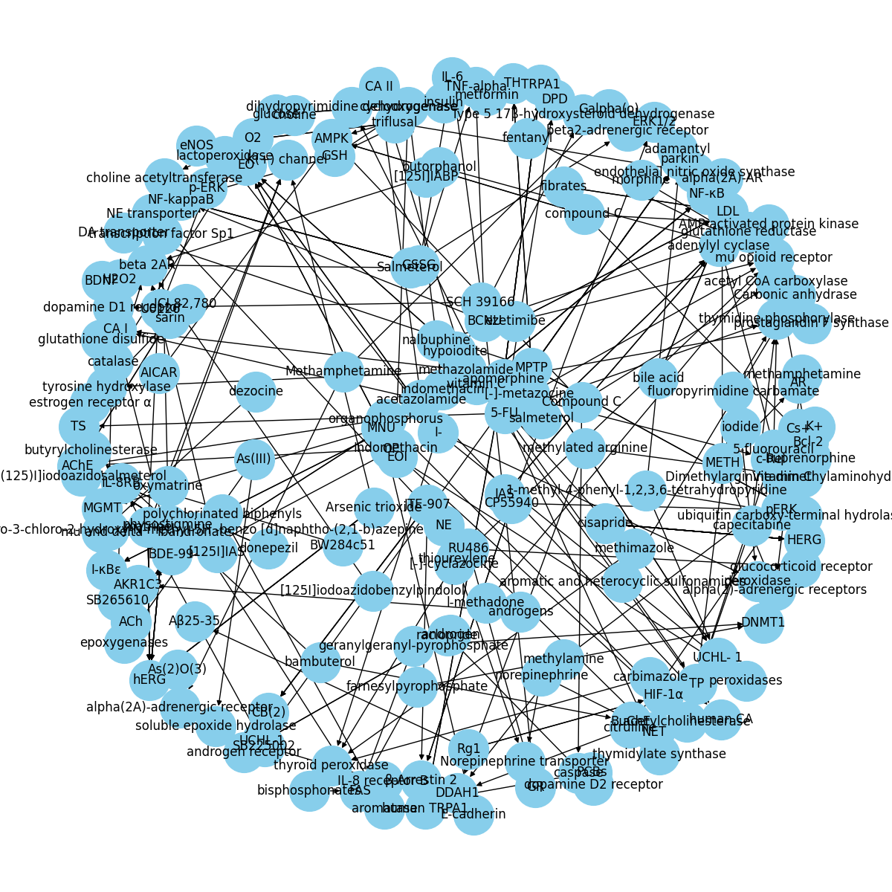

# ChemProt/DrugProt Testing Ground
Testing ground for [task 5](https://biocreative.bioinformatics.udel.edu/tasks/biocreative-vi/track-5/) from BioCreative VI
> Task 5: Text mining chemical-protein interactions (CHEMPROT)
>
> The aim of the CHEMPROT task of BioCreative VI is to promote the development and evaluation of systems that are able
> to automatically detect in running text (PubMed abstracts) relations between chemical compounds/drug and genes/proteins.
> We will therefore release a manually annotated corpus, the CHEMPROT corpus, where domain experts have exhaustively labeled:
> (a) all chemical and gene mentions, and
> (b) all binary relationships between them corresponding to a specific set of biologically relevant relation types
> (CHEMPROT relation classes).

## Working Environment
- Ubuntu 20.04
- CUDA 11.2
- PyTorch 1.8.1+cu111

## Data Structure
```
data/
├── chemprot_development
│   ├── chemprot_development_abstracts.tsv
│   ├── chemprot_development_entities.tsv
│   ├── chemprot_development_gold_standard.tsv
│   ├── chemprot_development_relations.tsv
│   └── Readme.pdf
├── chemprot_sample
│   ├── chemprot_sample_abstracts.tsv
│   ├── chemprot_sample_entities.tsv
│   ├── chemprot_sample_gold_standard.tsv
│   ├── chemprot_sample_predictions_eval.txt
│   ├── chemprot_sample_predictions.tsv
│   ├── chemprot_sample_relations.tsv
│   ├── guidelines
│   │   ├── CEM_guidelines.pdf
│   │   ├── CHEMPROT_guidelines_v6.pdf
│   │   └── GPRO_guidelines.pdf
│   └── Readme.pdf
├── chemprot_test_gs
│   ├── chemprot_test_abstracts_gs.tsv
│   ├── chemprot_test_entities_gs.tsv
│   ├── chemprot_test_gold_standard.tsv
│   ├── chemprot_test_relations_gs.tsv
│   └── readme_test_gs.pdf
└── chemprot_training
    ├── chemprot_training_abstracts.tsv
    ├── chemprot_training_entities.tsv
    ├── chemprot_training_gold_standard.tsv
    ├── chemprot_training_relations.tsv
    └── Readme.pdf

5 directories, 25 files
```
## Example

### PMID
10471277

### Title
Probing the salmeterol binding site on the beta 2-adrenergic receptor using a novel photoaffinity ligand,[(125)I]iodoazidosalmeterol.

### Abstract
Salmeterol is a long-acting beta2-adrenergic receptor (beta 2AR) agonist used clinically to treat asthma. In addition
to binding at the active agonist site, it has been proposed that salmeterol also binds with very high affinity at a second site,
termed the "exosite", and that this exosite contributes to the long duration of action of salmeterol. To determine the
position of the phenyl ring of the aralkyloxyalkyl side chain of salmeterol in the beta 2AR binding site, we designed
and synthesized the agonist photoaffinity label [(125)I]iodoazidosalmeterol ([125I]IAS). In direct adenylyl cyclase
activation, in effects on adenylyl cyclase after pretreatment of intact cells, and in guinea pig tracheal relaxation
assays, IAS and the parent drug salmeterol behave essentially the same. Significantly, the photoreactive azide of
IAS is positioned on the phenyl ring at the end of the molecule which is thought to be involved in exosite binding.
Carrier-free radioiodinated [125I]IAS was used to photolabel epitope-tagged human beta 2AR in membranes prepared from
stably transfected HEK 293 cells. Labeling with [(125)I]IAS was blocked by 10 microM (-)-alprenolol and inhibited by
addition of GTP gamma S, and [125I]IAS migrated at the same position on an SDS-PAGE gel as the beta 2AR labeled by the
antagonist photoaffinity label [125I]iodoazidobenzylpindolol ([125I]IABP). The labeled receptor was purified on a nickel
affinity column and cleaved with factor Xa protease at a specific sequence in the large loop between transmembrane
segments 5 and 6, yielding two peptides. While the control antagonist photoaffinity label [125I]IABP labeled both the
large N-terminal fragment [containing transmembranes (TMs) 1-5] and the smaller C-terminal fragment (containing TMs 6 and 7),
essentially all of the [125I]IAS labeling was on the smaller C-terminal peptide containing TMs 6 and 7. This direct
biochemical evidence demonstrates that when salmeterol binds to the receptor, its hydrophobic aryloxyalkyl tail is
positioned near TM 6 and/or TM 7. A model of IAS binding to the beta 2AR is proposed.

### Entity mention annotations
| PMID | Entity | Type | Start | End | Text |
| --- | --- | --- | --- | --- | --- |
|10471277|T1 |CHEMICAL|135 |145 |Salmeterol                   |
|10471277|T2 |CHEMICAL|1248|1259|[(125)I]IAS                  |
|10471277|T3 |CHEMICAL|1285|1299|(-)-alprenolol               |
|10471277|T4 |CHEMICAL|1329|1332|GTP                          |
|10471277|T5 |CHEMICAL|1346|1355|[125I]IAS                    |
|10471277|T6 |CHEMICAL|1467|1496|[125I]iodoazidobenzylpindolol|
|10471277|T7 |CHEMICAL|1498|1508|[125I]IABP                   |
|10471277|T8 |CHEMICAL|1550|1556|nickel                       |
|10471277|T9 |CHEMICAL|1762|1772|[125I]IABP                   |
|10471277|T10|CHEMICAL|1796|1797|N                            |
|10471277|T11|CHEMICAL|1870|1871|C                            |
|10471277|T12|CHEMICAL|1939|1948|[125I]IAS                    |
|10471277|T13|CHEMICAL|318 |328 |salmeterol                   |
|10471277|T14|CHEMICAL|1977|1978|C                            |
|10471277|T15|CHEMICAL|2076|2086|salmeterol                   |
|10471277|T16|CHEMICAL|2126|2138|aryloxyalkyl                 |
|10471277|T17|CHEMICAL|2192|2195|IAS                          |
|10471277|T18|CHEMICAL|472 |482 |salmeterol                   |
|10471277|T19|CHEMICAL|517 |523 |phenyl                       |
|10471277|T20|CHEMICAL|566 |576 |salmeterol                   |
|10471277|T21|CHEMICAL|667 |694 |[(125)I]iodoazidosalmeterol  |
|10471277|T22|CHEMICAL|696 |705 |[125I]IAS                    |
|10471277|T23|CHEMICAL|718 |726 |adenylyl                     |
|10471277|T24|CHEMICAL|761 |769 |adenylyl                     |
|10471277|T25|CHEMICAL|860 |863 |IAS                          |
|10471277|T26|CHEMICAL|884 |894 |salmeterol                   |
|10471277|T27|CHEMICAL|957 |962 |azide                        |
|10471277|T28|CHEMICAL|966 |969 |IAS                          |
|10471277|T29|CHEMICAL|991 |997 |phenyl                       |
|10471277|T30|CHEMICAL|1110|1119|[125I]IAS                    |
|10471277|T31|CHEMICAL|106 |133 |[(125)I]iodoazidosalmeterol  |
|10471277|T33|GENE-N  |1158|1172|human beta 2AR               |
|10471277|T34|GENE-N  |1412|1420|beta 2AR                     |
|10471277|T35|GENE-N  |1590|1599|factor Xa                    |
|10471277|T36|GENE-N  |2211|2219|beta 2AR                     |
|10471277|T37|GENE-N  |163 |188 |beta2-adrenergic receptor    |
|10471277|T38|GENE-N  |584 |592 |beta 2AR                     |
|10471277|T39|GENE-N  |190 |198 |beta 2AR                     |
|10471277|T40|GENE-N  |43  |69  |beta 2-adrenergic receptor   |
|10471277|T32|CHEMICAL|12  |22  |salmeterol                   |
|10471277|T41|CHEMICAL|536 |551 |aralkyloxyalkyl              |
|10471277|T42|GENE-Y  |718 |734 |adenylyl cyclase             |
|10471277|T44|GENE-Y  |761 |777 |adenylyl cyclase             |

### CHEMPROT detailed relation annotations
| PMID | CPR Group | Evaluation Type | CPR | Arg1 | Arg2 |
|--------|---|--------|----|----|-----------------------------|
|10471277|CPR:2|N       |DIRECT-REGULATOR|Arg1:T30|Arg2:T33                     |
|10471277|CPR:2|N       |DIRECT-REGULATOR|Arg1:T31|Arg2:T40                     |
|10471277|CPR:2|N       |DIRECT-REGULATOR|Arg1:T32|Arg2:T40                     |
|10471277|CPR:5|Y       |AGONIST|Arg1:T1|Arg2:T37                     |
|10471277|CPR:5|Y       |AGONIST|Arg1:T1|Arg2:T39                     |
|10471277|CPR:2|N       |DIRECT-REGULATOR|Arg1:T20|Arg2:T38                     |
|10471277|CPR:2|N       |DIRECT-REGULATOR|Arg1:T41|Arg2:T38                     |
|10471277|CPR:2|N       |DIRECT-REGULATOR|Arg1:T19|Arg2:T38                     |
|10471277|CPR:5|Y       |AGONIST|Arg1:T21|Arg2:T38                     |
|10471277|CPR:5|Y       |AGONIST|Arg1:T22|Arg2:T38                     |
|10471277|CPR:3|Y       |UPREGULATOR|Arg1:T25|Arg2:T42                     |
|10471277|CPR:3|Y       |UPREGULATOR|Arg1:T26|Arg2:T42                     |
|10471277|CPR:3|Y       |UPREGULATOR|Arg1:T25|Arg2:T44                     |
|10471277|CPR:3|Y       |UPREGULATOR|Arg1:T26|Arg2:T44                     |
|10471277|CPR:6|Y       |ANTAGONIST|Arg1:T6|Arg2:T34                     |
|10471277|CPR:6|Y       |ANTAGONIST|Arg1:T7|Arg2:T34                     |
|10471277|CPR:2|N       |DIRECT-REGULATOR|Arg1:T5|Arg2:T34                     |
|10471277|CPR:2|N       |DIRECT-REGULATOR|Arg1:T2|Arg2:T34                     |
|10471277|CPR:2|N       |DIRECT-REGULATOR|Arg1:T17|Arg2:T36                     |
|10471277|CPR:2|N       |DIRECT-REGULATOR|Arg1:T3|Arg2:T34                     |

### CHEMPROT task Gold Standard data and predictions
- File: chemprot_sample_gold_standard.tsv

| PMID | CPR Group | Arg1 | Arg2 |
|--------|---|--------|----|
|10471277|CPR:5|Arg1:T1 |Arg2:T37|
|10471277|CPR:5|Arg1:T1 |Arg2:T39|
|10471277|CPR:5|Arg1:T21|Arg2:T38|
|10471277|CPR:5|Arg1:T22|Arg2:T38|
|10471277|CPR:3|Arg1:T25|Arg2:T42|
|10471277|CPR:3|Arg1:T26|Arg2:T42|
|10471277|CPR:3|Arg1:T25|Arg2:T44|
|10471277|CPR:3|Arg1:T26|Arg2:T44|
|10471277|CPR:6|Arg1:T6 |Arg2:T34|
|10471277|CPR:6|Arg1:T7 |Arg2:T34|

- File: chemprot_sample_predictions.tsv

| PMID | CPR Group | Arg1 | Arg2 |
|--------|---|--------|----|
|10471277|CPR:5|Arg1:T17|Arg2:T36|
|10471277|CPR:5|Arg1:T1 |Arg2:T37|
|10471277|CPR:5|Arg1:T1 |Arg2:T39|
|10471277|CPR:5|Arg1:T20|Arg2:T38|
|10471277|CPR:5|Arg1:T21|Arg2:T38|
|10471277|CPR:5|Arg1:T22|Arg2:T38|
|10471277|CPR:5|Arg1:T31|Arg2:T40|
|10471277|CPR:5|Arg1:T32|Arg2:T40|
|10471277|CPR:6|Arg1:T6 |Arg2:T34|
|10471277|CPR:6|Arg1:T7 |Arg2:T34|

## Knowledge Graph results


## Resources
[BLUE, the Biomedical Language Understanding Evaluation benchmark](https://github.com/ncbi-nlp/BLUE_Benchmark)

[Chemical-protein Interaction Extraction
via Gaussian Probability Distribution and External Biomedical Knowledge](https://github.com/CongSun-dlut/CPI_extraction)

## Scibert
Model file of scibert_scivocab_uncased:
```
wget "https://s3-us-west-2.amazonaws.com/ai2-s2-research/scibert/pytorch_models/scibert_scivocab_uncased.tar"
```

# info
## dist info
| Set | PMID | Pos | Neg |
| --- | --- | --- | --- |
| train | 3500 | 16956 | 48621 |
| dev | 750 | 3712 | 9690 |
| test | 10750 | 0 | 220315 |

```
NONE                      48197
INHIBITOR                  5326
DIRECT-REGULATOR           2153
SUBSTRATE                  1988
ACTIVATOR                  1381
INDIRECT-UPREGULATOR       1337
INDIRECT-DOWNREGULATOR     1316
ANTAGONIST                  937
PRODUCT-OF                  917
PART-OF                     877
AGONIST                     646
AGONIST-ACTIVATOR            28
SUBSTRATE_PRODUCT-OF         24
AGONIST-INHIBITOR            10
Name: relation, dtype: int64

NONE                      9683
INHIBITOR                 1136
SUBSTRATE                  494
DIRECT-REGULATOR           452
INDIRECT-DOWNREGULATOR     329
INDIRECT-UPREGULATOR       298
PART-OF                    254
ACTIVATOR                  234
ANTAGONIST                 214
PRODUCT-OF                 156
AGONIST                    126
AGONIST-ACTIVATOR           10
SUBSTRATE_PRODUCT-OF         3
AGONIST-INHIBITOR            2
Name: relation, dtype: int64
```

## LM Results
| Base Language Model | Annotation Style | Negative Samples in Training Set | F1 Score on Development Set |
| --- | --- | --- | --- |
| bert_base_uncased | none | no | 0.552 |
| scibert_uncased | scibert | no | 0.739 |
| biobert_base_v1.1 | biobert | no | 0.727 |
| bert_base_uncased | none | yes | 0.348 |
| scibert_uncased | scibert | yes | 0.586 |
| biobert_base_v1.1 | biobert | yes | 0.581 |

## New Results
| Base Language Model | Annotation Style | Knowledge Graph Model | F1 Score on Development Set |
| --- | --- | --- | --- |
| bert_base_uncased | raw | none | 0.765 |
| bert_base_uncased | SciBert | none | 0.864 |
| bert_base_uncased | BioBert | none | 0.863 |
| scibert_scivocab_uncased | raw | none | 0.776 |
| scibert_scivocab_uncased | SciBert | none | 0.876 |
| scibert_scivocab_uncased | BioBert | none | 0.869 |
| biobert-base-cased-v1.1 | raw | none | 0.776 |
| biobert-base-cased-v1.1 | SciBert | none | 0.876 |
| biobert-base-cased-v1.1 | BioBert | none | 0.875 |
| bert_base_uncased | raw | TransE | 0.768 |
| bert_base_uncased | SciBert | TransE | 0.858 |
| bert_base_uncased | BioBert | TransE | 0.856 |
| scibert_scivocab_uncased | raw | TransE | 0.776 |
| scibert_scivocab_uncased | SciBert | TransE | 0.872 |
| scibert_scivocab_uncased | BioBert | TransE | 0.868 |
| biobert-base-cased-v1.1 | raw | TransE | 0.778 |
| biobert-base-cased-v1.1 | SciBert | TransE | 0.873 |
| biobert-base-cased-v1.1 | BioBert | TransE | 0.863 |
| bert_base_uncased | raw | PairRE | 0.769 |
| bert_base_uncased | SciBert | PairRE | 0.858 |
| bert_base_uncased | BioBert | PairRE | 0.857 |
| scibert_scivocab_uncased | raw | PairRE | 0.779 |
| scibert_scivocab_uncased | SciBert | PairRE | 0.871 |
| scibert_scivocab_uncased | BioBert | PairRE | 0.867 |
| biobert-base-cased-v1.1 | raw | PairRE | 0.778 |
| biobert-base-cased-v1.1 | SciBert | PairRE | 0.872 |
| biobert-base-cased-v1.1 | BioBert | PairRE | 0.862 |

## Code structure
drugprot_preprocess_data

```
2021-09-28 02:08:03,003 - INFO - model: bert-base-uncased, annotation: raw
2021-09-28 02:08:03,003 - INFO - Loading file from data/drugprot_preprocessed/bin/development
2021-09-28 02:08:04,139 - INFO - f1 score: 0.765
2021-09-28 02:08:04,139 - INFO - model: bert-base-uncased, annotation: sci
2021-09-28 02:08:04,139 - INFO - Loading file from data/drugprot_preprocessed/bin/development
2021-09-28 02:08:04,939 - INFO - f1 score: 0.864
2021-09-28 02:08:04,940 - INFO - model: bert-base-uncased, annotation: bio
2021-09-28 02:08:04,940 - INFO - Loading file from data/drugprot_preprocessed/bin/development
2021-09-28 02:08:05,764 - INFO - f1 score: 0.863
2021-09-28 02:08:05,764 - INFO - model: allenai/scibert_scivocab_uncased, annotation: raw
2021-09-28 02:08:05,764 - INFO - Loading file from data/drugprot_preprocessed/bin/development
2021-09-28 02:08:06,553 - INFO - f1 score: 0.776
2021-09-28 02:08:06,553 - INFO - model: allenai/scibert_scivocab_uncased, annotation: sci
2021-09-28 02:08:06,553 - INFO - Loading file from data/drugprot_preprocessed/bin/development
2021-09-28 02:08:07,344 - INFO - f1 score: 0.876
2021-09-28 02:08:07,344 - INFO - model: allenai/scibert_scivocab_uncased, annotation: bio
2021-09-28 02:08:07,344 - INFO - Loading file from data/drugprot_preprocessed/bin/development
2021-09-28 02:08:08,177 - INFO - f1 score: 0.869
2021-09-28 02:08:08,177 - INFO - model: dmis-lab/biobert-base-cased-v1.1, annotation: raw
2021-09-28 02:08:08,177 - INFO - Loading file from data/drugprot_preprocessed/bin/development
2021-09-28 02:08:08,964 - INFO - f1 score: 0.776
2021-09-28 02:08:08,964 - INFO - model: dmis-lab/biobert-base-cased-v1.1, annotation: sci
2021-09-28 02:08:08,964 - INFO - Loading file from data/drugprot_preprocessed/bin/development
2021-09-28 02:08:09,750 - INFO - f1 score: 0.876
2021-09-28 02:08:09,750 - INFO - model: dmis-lab/biobert-base-cased-v1.1, annotation: bio
2021-09-28 02:08:09,750 - INFO - Loading file from data/drugprot_preprocessed/bin/development
2021-09-28 02:08:10,545 - INFO - f1 score: 0.875
2021-09-28 02:08:10,545 - INFO - kg_model: TransE, lm_model: bert-base-uncased, annotation: raw
2021-09-28 02:08:10,545 - INFO - Loading file from data/drugprot_preprocessed/bin/development
2021-09-28 02:08:11,366 - INFO - f1 score: 0.768
2021-09-28 02:08:11,366 - INFO - kg_model: TransE, lm_model: bert-base-uncased, annotation: sci
2021-09-28 02:08:11,367 - INFO - Loading file from data/drugprot_preprocessed/bin/development
2021-09-28 02:08:12,151 - INFO - f1 score: 0.858
2021-09-28 02:08:12,151 - INFO - kg_model: TransE, lm_model: bert-base-uncased, annotation: bio
2021-09-28 02:08:12,151 - INFO - Loading file from data/drugprot_preprocessed/bin/development
2021-09-28 02:08:12,936 - INFO - f1 score: 0.856
2021-09-28 02:08:12,937 - INFO - kg_model: TransE, lm_model: allenai/scibert_scivocab_uncased, annotation: raw
2021-09-28 02:08:12,937 - INFO - Loading file from data/drugprot_preprocessed/bin/development
2021-09-28 02:08:13,723 - INFO - f1 score: 0.776
2021-09-28 02:08:13,723 - INFO - kg_model: TransE, lm_model: allenai/scibert_scivocab_uncased, annotation: sci
2021-09-28 02:08:13,723 - INFO - Loading file from data/drugprot_preprocessed/bin/development
2021-09-28 02:08:14,541 - INFO - f1 score: 0.872
2021-09-28 02:08:14,541 - INFO - kg_model: TransE, lm_model: allenai/scibert_scivocab_uncased, annotation: bio
2021-09-28 02:08:14,541 - INFO - Loading file from data/drugprot_preprocessed/bin/development
2021-09-28 02:08:15,326 - INFO - f1 score: 0.868
2021-09-28 02:08:15,326 - INFO - kg_model: TransE, lm_model: dmis-lab/biobert-base-cased-v1.1, annotation: raw
2021-09-28 02:08:15,326 - INFO - Loading file from data/drugprot_preprocessed/bin/development
2021-09-28 02:08:16,110 - INFO - f1 score: 0.778
2021-09-28 02:08:16,110 - INFO - kg_model: TransE, lm_model: dmis-lab/biobert-base-cased-v1.1, annotation: sci
2021-09-28 02:08:16,110 - INFO - Loading file from data/drugprot_preprocessed/bin/development
2021-09-28 02:08:16,894 - INFO - f1 score: 0.873
2021-09-28 02:08:16,894 - INFO - kg_model: TransE, lm_model: dmis-lab/biobert-base-cased-v1.1, annotation: bio
2021-09-28 02:08:16,894 - INFO - Loading file from data/drugprot_preprocessed/bin/development
2021-09-28 02:08:17,712 - INFO - f1 score: 0.863
2021-09-28 02:08:17,712 - INFO - kg_model: PairRE, lm_model: bert-base-uncased, annotation: raw
2021-09-28 02:08:17,712 - INFO - Loading file from data/drugprot_preprocessed/bin/development
2021-09-28 02:08:18,495 - INFO - f1 score: 0.769
2021-09-28 02:08:18,495 - INFO - kg_model: PairRE, lm_model: bert-base-uncased, annotation: sci
2021-09-28 02:08:18,495 - INFO - Loading file from data/drugprot_preprocessed/bin/development
2021-09-28 02:08:19,280 - INFO - f1 score: 0.858
2021-09-28 02:08:19,280 - INFO - kg_model: PairRE, lm_model: bert-base-uncased, annotation: bio
2021-09-28 02:08:19,280 - INFO - Loading file from data/drugprot_preprocessed/bin/development
2021-09-28 02:08:20,099 - INFO - f1 score: 0.857
2021-09-28 02:08:20,099 - INFO - kg_model: PairRE, lm_model: allenai/scibert_scivocab_uncased, annotation: raw
2021-09-28 02:08:20,099 - INFO - Loading file from data/drugprot_preprocessed/bin/development
2021-09-28 02:08:20,883 - INFO - f1 score: 0.779
2021-09-28 02:08:20,883 - INFO - kg_model: PairRE, lm_model: allenai/scibert_scivocab_uncased, annotation: sci
2021-09-28 02:08:20,883 - INFO - Loading file from data/drugprot_preprocessed/bin/development
2021-09-28 02:08:21,667 - INFO - f1 score: 0.871
2021-09-28 02:08:21,667 - INFO - kg_model: PairRE, lm_model: allenai/scibert_scivocab_uncased, annotation: bio
2021-09-28 02:08:21,667 - INFO - Loading file from data/drugprot_preprocessed/bin/development
2021-09-28 02:08:22,450 - INFO - f1 score: 0.867
2021-09-28 02:08:22,450 - INFO - kg_model: PairRE, lm_model: dmis-lab/biobert-base-cased-v1.1, annotation: raw
2021-09-28 02:08:22,450 - INFO - Loading file from data/drugprot_preprocessed/bin/development
2021-09-28 02:08:23,268 - INFO - f1 score: 0.778
2021-09-28 02:08:23,268 - INFO - kg_model: PairRE, lm_model: dmis-lab/biobert-base-cased-v1.1, annotation: sci
2021-09-28 02:08:23,268 - INFO - Loading file from data/drugprot_preprocessed/bin/development
2021-09-28 02:08:24,051 - INFO - f1 score: 0.872
2021-09-28 02:08:24,052 - INFO - kg_model: PairRE, lm_model: dmis-lab/biobert-base-cased-v1.1, annotation: bio
2021-09-28 02:08:24,052 - INFO - Loading file from data/drugprot_preprocessed/bin/development
2021-09-28 02:08:24,841 - INFO - f1 score: 0.862
```